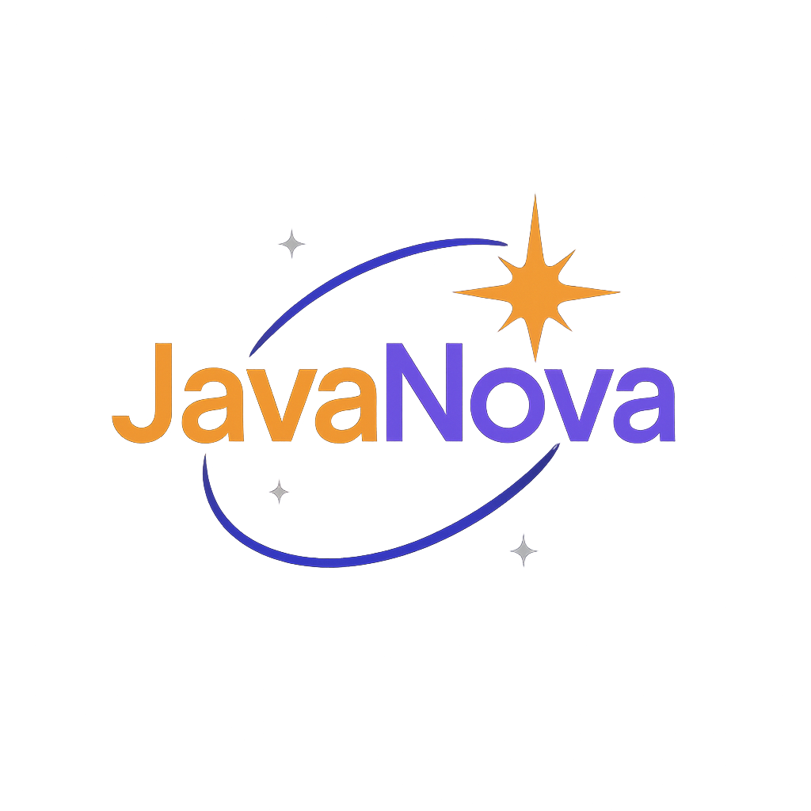

# JavaNova Academy Website

This professional education platform website was entirely generated by **DeepSeek-R1 AI** based on a detailed design prompt. The site features a modern space-themed design focused on Java programming education.

## AI Generation Details
- **AI Model**: DeepSeek-R1
- **Creation Method**: Generated from comprehensive design and content specifications
- **Prompt Used**:  
[View the exact prompt used for creation](PROMPT.md)

## Features

- 🚀 **Modern Space Theme** with orange (#FF8C42) and purple (#8B5CF6) color scheme
- 📱 **Fully Responsive** design (mobile-first approach)
- 🧭 **Interactive Navigation** with smooth scrolling
- 💻 **Course Catalog** with filtering functionality
- 💰 **Pricing Plans** with monthly/annual toggle switch
- 👨‍🏫 **Instructor Profiles** section
- 📝 **Contact Form** with validation
- 📊 **Animated Statistics** counters
- 🎨 **CSS Animations** and hover effects

## Technologies Used

- **Frontend**: 
  - HTML5 (semantic structure)
  - CSS3 (Flexbox, Grid, animations)
  - JavaScript (vanilla ES6)
- **Design**:
  - Space/orbital theme
  - Responsive breakpoints
  - Modern typography (Poppins and Roboto Mono)
- **Libraries**:
  - Font Awesome (v6.4.0)
  - Google Fonts

## Sections Included

1. **Header** with navigation and hero section
2. **About** with mission and statistics
3. **Courses** with filtering
4. **Features** highlighting platform advantages
5. **Pricing** with interactive plans
6. **Instructors** profiles
7. **Contact** section with form
8. **Footer** with comprehensive links

## How to Use

1. Download the project files
2. Open `index.html` in any modern web browser
3. Explore the responsive design at different screen sizes

No additional dependencies required!

## Customization

To customize the website:
1. Modify colors in the `:root` CSS variables
2. Update content in the HTML file
3. Adjust animations in the CSS
4. Modify JavaScript interactions

## License

This project is licensed under the MIT License. See [LICENSE](LICENSE) for details.

---
